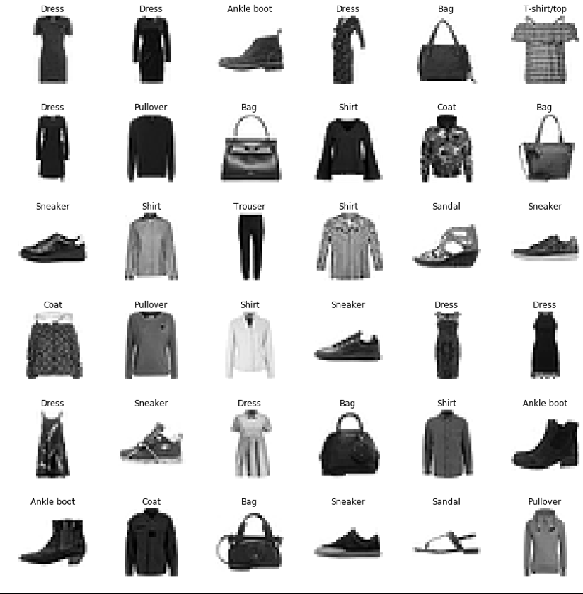

# FashionMNISTImageDetection

This repository detects images in the Fashion MNIST data set using two different neural-network based models.

- **Lab09_Armstrong.ipynb** is a Jupyter notebook that runs an internally-coded multi-layer perceptron (MLP) model. The Fashion MNIST data set is initially obtained from OpenML via a `fetch_openml` call from the `sklearn.datasets` library. After the initial slow read from OpenML, the data set is saved to a pickle file and future reads are read directly from the pickle file for efficiency.
- **Lab09_Armstrong_PyTorch.ipynb** is a Jupyter notebool that runs a CNN on the data set using the PyTorch framework. This notebook is designed to be run in the Google CoLab environment. The FashionMNIST data set (which can be onbtained elsewhere) is assumed to be available as `.CSV` files in the runtime directory. 

A good source from which to obtain the Fashion MNIST data set is right here in the GitHub ecosystem at https://github.com/zalandoresearch/fashion-mnist. 

